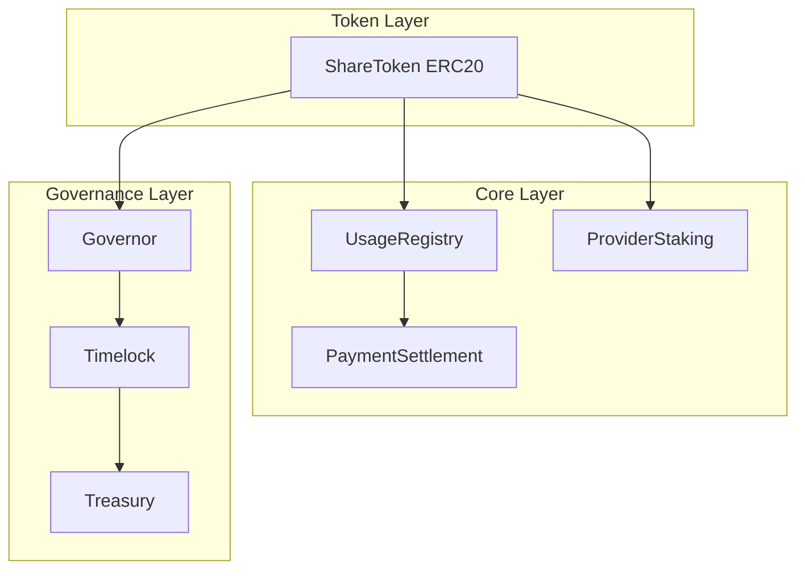

# LLM Share Network - Smart Contracts Architecture

## Overview

LLM Share Network is a decentralized platform for LLM API usage tracking and incentivization. The smart contract system handles usage recording, payment settlement, provider staking, and DAO governance.

## Contract Architecture



## Contract Details

### 1. ShareToken (ERC20)
- **Type**: Upgradeable (Transparent Proxy)
- **Features**: 
  - Dynamic minting based on LLM token consumption
  - Distribution: 85% Provider, 10% Treasury, 5% LP
  - Per-model minting rates (claude-3-opus: 1000, gpt-4-turbo: 800, etc.)
  - Max 20% rate change per update

### 2. UsageRegistry
- **Type**: Upgradeable
- **Features**:
  - Records API usage (model, tokens, consumer, provider)
  - Anti-replay via nonce
  - Time-range queries

### 3. PaymentSettlement
- **Type**: Upgradeable
- **Features**:
  - Single and batch settlement
  - Dispute mechanism
  - Role-based access (SETTLER_ROLE, DISPUTE_RESOLVER_ROLE)

### 4. ProviderStaking
- **Type**: Upgradeable
- **Features**:
  - 4-tier system (Basic/Verified/Premium/Enterprise)
  - 7-day unstake cooldown
  - Slashing mechanism
  - Reward claiming

### 5. Governance Contracts
- **Timelock**: 2-day delay, no proxy
- **Governor**: 1-day voting delay, 7-day voting period, 10k threshold, 4% quorum
- **Treasury**: Upgradeable, freeze mechanism

## Security Model

### Access Control
- All contracts use OpenZeppelin AccessControl
- Role-based permissions for sensitive operations
- Multi-sig recommended for admin roles

### Upgrade Safety
- Transparent proxy pattern for upgradeable contracts
- Governor/Timelock NOT upgradeable (governance layer security)
- Initializer pattern replaces constructors

### Reentrancy Protection
- ReentrancyGuard on all external calls
- Checks-Effects-Interactions pattern

## Deployment

```bash
# Deploy all contracts
npx hardhat run scripts/deploy/deploy-all.ts --network <network>

# Verify contracts
npx hardhat run scripts/verify/verify-contracts.ts --network <network>
```

## Testing

- **Unit Tests**: `npx hardhat test`
- **Fuzz Tests**: `forge test`
- **Coverage**: `npx hardhat coverage`

## License

MIT License

