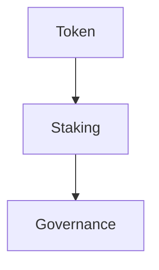

# 系统架构设计

## 概述

LLM Share Network 智能合约系统的核心设计目标是实现去中心化的 LLM 资源共享和代币激励机制。

## 合约架构

## 合约关系

- **Token**: 系统的核心代币。
- **Staking**: 节点质押和奖励分配。
- **Governance**: 协议参数治理。

## 安全模型

- 使用 OpenZeppelin 标准库。
- 权限控制（AccessControl/Ownable）。
- 关键操作的重入保护。

## 升级策略

- TODO: 描述合约升级方案（如 Transparent Proxy 或 UUPS）。
